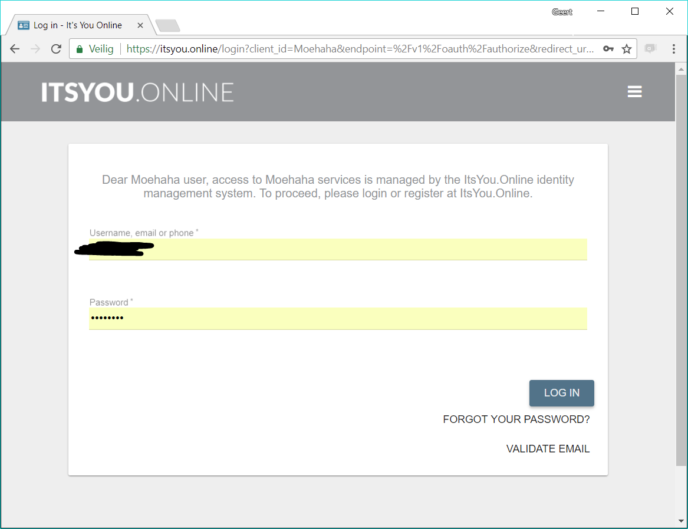
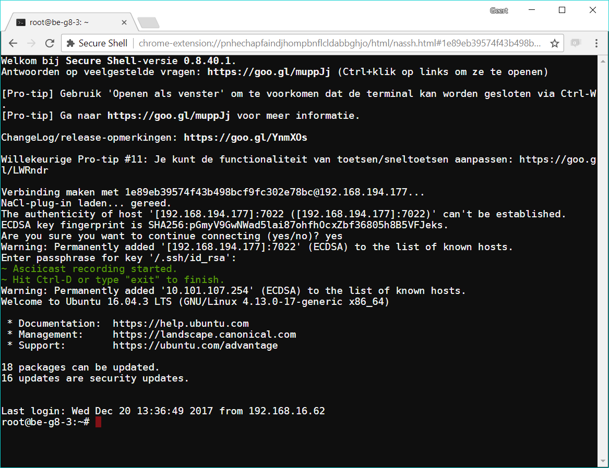
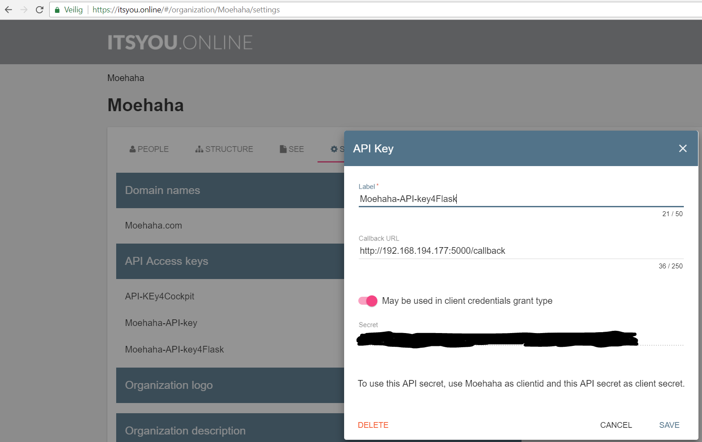

# 0-access
Itsyou.online authenticated and monitored ssh access via web, completely replayable via asciinema.


*After accessing the server on http://x.x.x.x/ssh/[target ip]*


*Ssh access to target nodes via chrome Secure Shell plugin*

# Usage
The following cmd line starts a 0-access instance on http port 5000 ip 192.168.194.177, ssh port 7022, authenticating people against the "Moehaha" organization in itsyou.online, with a timeout of 3600 seconds for the ssh session.
```bash
docker run --name 0-access -v /root/.ssh:/root/.ssh -p 5000:5000 -p 7022:22 openvcloud/0-access python3 /opt/0-access/0-access.py Moehaha ****** Moehaha http://192.168.194.177:5000 5000 192.168.194.177 7022 3600
```

See also: https://hub.docker.com/r/openvcloud/0-access/

## Important mounts 
- /root/.ssh: This directory inside the docker container expects the `id_rsa` private ssh key that has access to the nodes to which it needs to provide ssh access.
- /var/recordings: This directory will be used to store the recordings, and the full text search index of the recordings. Note that this directory needs to writeable to every one (777).

## Important port mappings
- http port. This port ca be set as one of the parameters to the 0-access.py server. Need to make sure it gets portmapped to one of the exposed ports of the docker container.
- ssh port. The ssh daemon in the docker container will be listening to port 22. This port needs to be exposed via a portmapping. The exposed port needs to correspond to the ssh port parameter passed to the 0-access.py

# 0-access.py
0-access.py is the hart of the system. It handles the 
- authentication with itsyou.online
- provisions tmp user accounts in the 0-access docker
- removes tmp user accounts in the 0-access docker after they expire or when a user logs out
- stores sessions in the integrated database
- serves the rest api's
- handles the full text indexing of the stored ssh sessions

0-access.py cli parameters:
```bash
python3 0-access.py --help
usage: 0-access.py [-h]
                   client_id client_secret organization uri port ssh_ip
                   ssh_port session_timeout

0-access server

positional arguments:
  client_id        Itsyou.Online client id
  client_secret    Itsyou.Online client secret
  organization     Itsyou.Online organization
  uri              uri, Eg http://localhost:4000
  port             Port to listen for connections
  ssh_ip           Ip address for the ssh server
  ssh_port         Port for the ssh server
  session_timeout  Time when session will timeout, and be killed

optional arguments:
  -h, --help       show this help message and exit
```

## CLI parameters explained
- client_id: The Itsyou.Online client id of the client_id / client_secret pair authenticating 0-access.py towards the Itsyou.online oauth provider. See https://gig.gitbooks.io/itsyouonline/content/oauth2/oauth2.html for more details.
- client_secret: The Itsyou.Online client secret of the client_id / client_secret pair authenticating 0-access.py towards the Itsyou.online oauth provider. See https://gig.gitbooks.io/itsyouonline/content/oauth2/oauth2.html for more details.
- organization: The organization in Itsyou.online of which people need to be member of to be able to have access to the 0-access server.
- uri: The public exposed uri that users need to target to access the 0-access server.
- port: The port to which the 0-access server needs to listen for incomming http requests. It is recommended to put a reverse proxy server in front of the 0-access server that accepts https connections and proxies them to the 0-access http server.
- ssh_ip: The ip address that users need to target to ssh to the 0-access server.
- ssh_port: The port that users need to target to ssh to the 0-access server.
- session_timeout: The maximum amount of seconds for an ssh session.

## Configuring the IYO client_id / client_secret
On the organization in Itsyou.Online add an api key, configure the callback to uri/callback and select the "May be used in client credentials" switch.



# Web services

## /provision/[target ip]
Provisions an ssh session for the logged on user. If the user is not logged in yet, he will be redirected to itsyou.online first.
> authenticated

request:
```
[GET or POST] /provision/[target ip]
```

response:
```
Content-Length:126
Content-Type:application/json
Date:Wed, 20 Dec 2017 16:26:37 GMT

{
  "ssh_ip": "192.168.194.177", 
  "ssh_port": 7022, 
  "username": "af013877fd974e8ab5ef4d7878a3fcaa", 
  "warned": false
}
```

## /sessions
List ssh sessions.
> unauthenticated

### query parameters
- page: optional integer for paging through results
- user: optional string to filter on usernames (itsyou.online usernames)
- remote: optional string to filter on the ssh target ip
- query: optional string to full text search on ssh content

## /sessions/[session id]
Download asciinema formatted ssh session. The downloaded file can be re-played with the asciinema play command or via the asciinema web based player.