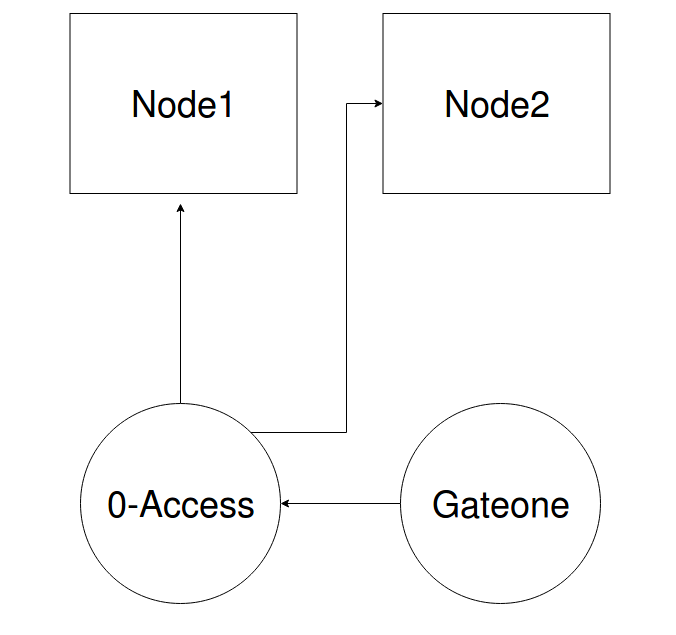

# 0-access with Gateone installation

**Gateone** is an HTML5-powered terminal emulator and SSH client. You can use it with **0-access** to enable the user to connect to his machines.

After authorizing 0-access node ssh key into other nodes, your Gateone can be used to connect to 0-access node through the temporarily generated username and password and hence can connect to all other nodes.

  

### Installation

You can Install gate one using: 

1 - jumpscale9 prefab:
```bash
js9 'j.tools.prefab.local.network.gateone.build()'
js9 'j.tools.prefab.local.network.gateone.install()'
```
Then you can start the gateone server:
```bash
js9 'j.tools.prefab.network.gateone.start(address={ipaddr}, port={port})'
```
Where the `ipaddr` and `port` are the ip and the port which will gateone web server listens to.

2 - Official docs [here](http://liftoff.github.io/GateOne/About/installation.html)


### Running 0-access with gateone support
To be able to run 0-access with the support of gateone you will need to provide 0-access script with the gateone instance url when running:
```bash
./0-access.py {IYO_ORG} {IYO_CLIENT_SECRET}  {ZERO_ACCESS_URI} {ZERO_ACCESS_PORT} {SSH_IP} {SSH_PORT} {SESSION_TIMEOUT} --gateone-url {GATEONE_URL}
```

For a full deployment example script on openvcloud using zeroaccess and gateone prefab modules: [zeroaccess](https://docs.grid.tf/despiegk/itenv_test/src/branch/master/zeroaccess.py) (*needs access permission*)
